# Using MongoDB Stitch to Create a Microservices API Library

[Stitch](https://www.mongodb.com/cloud/stitch) is MongoDB's Backend as a Service offering - that is, Stitch can be the single point of contact for developers accessing your platform (whatever that platform may be). 

Here I'm going to demonstrate how Stitch's serverless framework can be used to expose APIs, so you can shield your development community from the nuances of your backend.

## Creating the API

My first API will be to get products by name:

    getProductsByName(name) -> {object}
    Return products

### Setting up MongoDB
To begin, log into [MongoDB Atlas](https://cloud.mongodb.com). If you don't already have an account, you can create one for free. Feel free to use an existing cluster for this exercise, but everything I do here will be on the free tier sandbox, which I coincidentally named **FreeTier**.

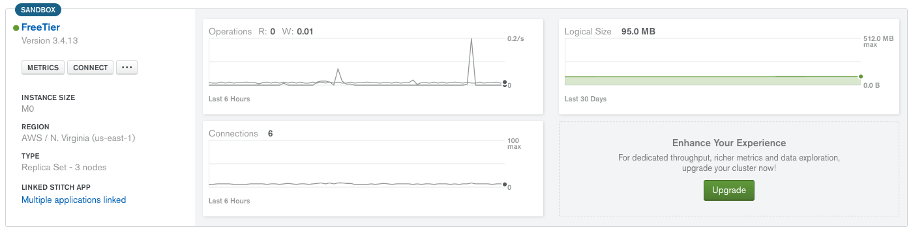

### Loading Data
Save the [products.json](sample-data/products.json) sample data set somewhere on your local workstation. 

In Atlas, drill into your cluster and select the **Command Line Tools** tab 

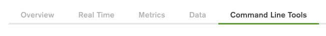

Then scroll down to the **Data Import and Export Tools** and copy the [mongoimport](https://docs.mongodb.com/manual/reference/program/mongoimport?_ga=2.252933577.1735168906.1521376247-1654085994.1512229165) command:

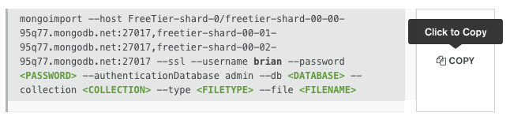

Open a terminal shell on your workstation at the directory where you downloaded the [products.json](sample-data/products.json) file and paste the copied mongoimport command. Set the `<PASSWORD>` to your password, `<DATABASE>` to **store**, the `<COLLECTION>` to **products**, the `<FILETYPE>` to **json** and the FILENAME to **products.json**. You can delete the `--type <FILETYPE>`. Run the command to import the product data in to MongoDB.

    $ mongoimport --host FreeTier-shard-0/freetier-shard-00-00-95q77.mongodb.net:27017,freetier-shard-00-01-95q77.mongodb.net:27017,freetier-shard-00-02-95q77.mongodb.net:27017 --ssl --username brian --password ******** --authenticationDatabase admin --db store --collection products --type json --file products.json
    2018-03-21T15:00:40.532-0400	connected to: FreeTier-shard-0/freetier-shard-00-00-95q77.mongodb.net:27017,freetier-shard-00-01-95q77.mongodb.net:27017,freetier-shard-00-02-95q77.mongodb.net:27017
    2018-03-21T15:00:40.638-0400	imported 6 documents

### Creating the Stitch Application

In Atlas, select **Stitch Apps** from the left navigation menu:

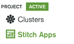

And then Create New Application:

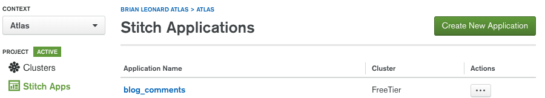

Name your application **Sports Store** and link it to the cluster which has your product data:

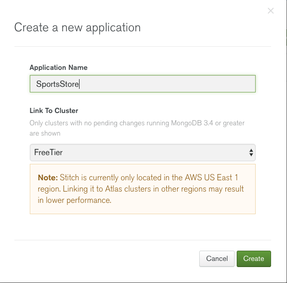

Wait while the Stitch application is created:

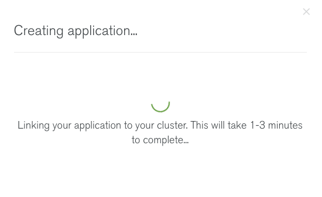

Once the Stitch application is created, you'll be presented with a "**Welcome to Stitch! Get started here.**" page. 

Stitch provides powerful security controls, which I'll address in a future exercise. For now, let's turn on Anonymous Authentication and point it to our store database and products collection:


### Creating the API

We are going to create our API using Stitch [Functions](https://docs.mongodb.com/stitch/functions/).

Select Step 5 Add a Function:

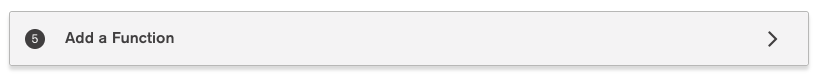

And then Create a New Function:

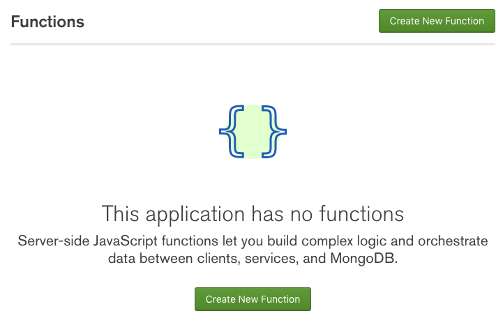

Name the function **getProductsByName**:

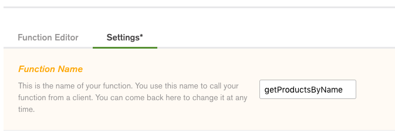

In the Function Editor, replace the code with the following:
```javascript
    exports = function(arg){
    console.log('Filter received: ' + arg);

    // Simplify testing
    arg = (arg == 'Hello world!' ? 'Baseball' : arg);  

    // Fetch all records containing filter. If no filter provided, fetch all records
    var filter = ((typeof arg !== 'undefined') ? {name:new BSON.BSONRegExp(arg, 'i')} : {});
    
    //Accessing a mongodb service:
    var collection = context.services.get("mongodb-atlas").db("store").collection("products");
    
    var results = collection.find(filter).toArray();  
    return results;
    };
```

And click the disk icon in the upper left to save the function:

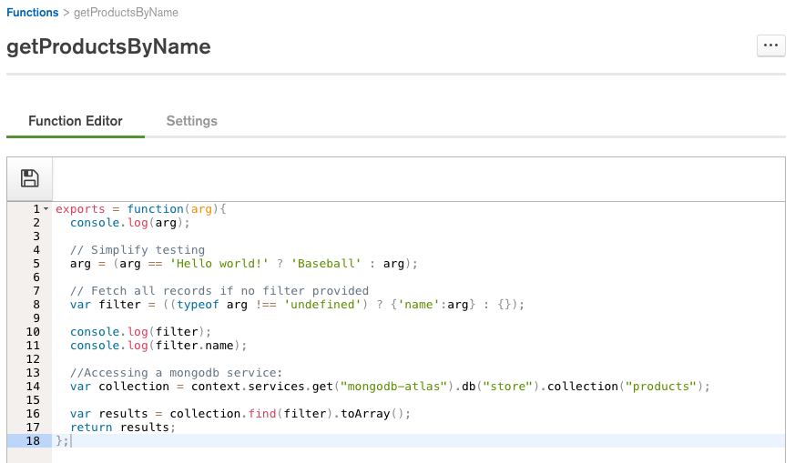

## Generate API Keys

For this example, we'll use API keys to assign to our users. Click Users on the left:

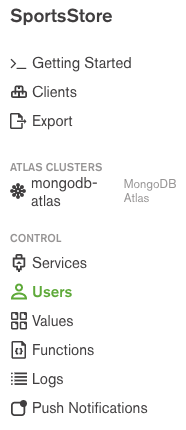

And then select Providers and Edit the API Keys:

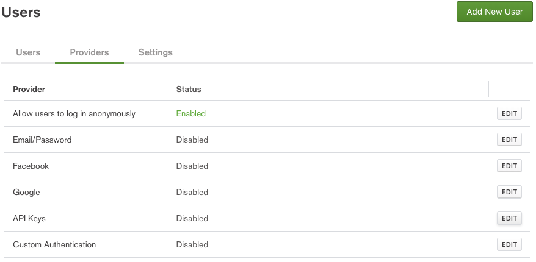

Set the Provider Status to Enabled and click **Create API Key**:

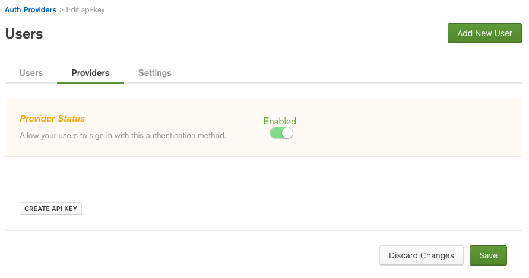

Name it **InternalTesting** and click **SAVE**:

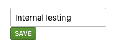

Since we are only using this key for internal testing, you don't have to worry about copying the value, but do so if it makes you feel comfortable:

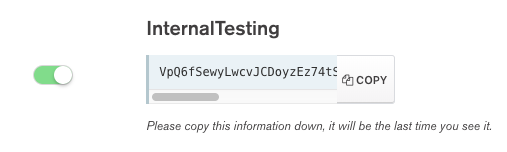

While we are here, let's create a second API key for our web client, named **WebClient**. I like using separate keys to distinguish who did what in the logs. In this case, you do want to copy the key, as we'll need it to connect from the web client later.

**Save** your changes.

## Test the API

Return to your function, `getProductsByName`. At the bottom of the functions page, in the Console, click **Select User** to select a user to run the function:

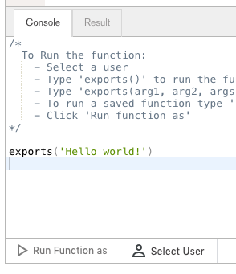

Select your InternalTesting user:

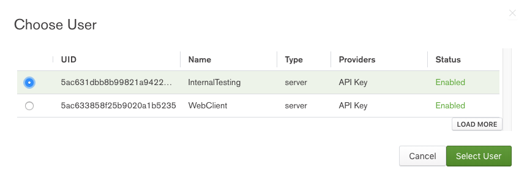

And click **Run Function as**:

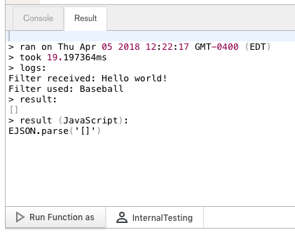

You'll notice we get no results, although we have a baseball in our store.  This is because, by default, Stitch has restricted assess to our collection. Let's fix this.

## Configure MongoDB Rules

To access data in a MongoDB database via Stitch, you must set up [rules](https://docs.mongodb.com/stitch/mongodb/mongodb-rules/#default-rules) to control access to fields for read and write operations.

Select **mongodb-atlas** under ATLAS CLUSTERS on the left:

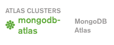

And select the **store.products** collection:

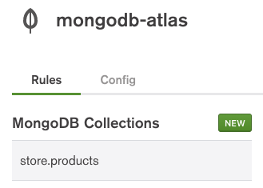

With the Top-Level Document selected, remove the `"owner_id": "%%user.id"` from the READ and WRITE fields under Permissions on top-level document:


Then save your changes:

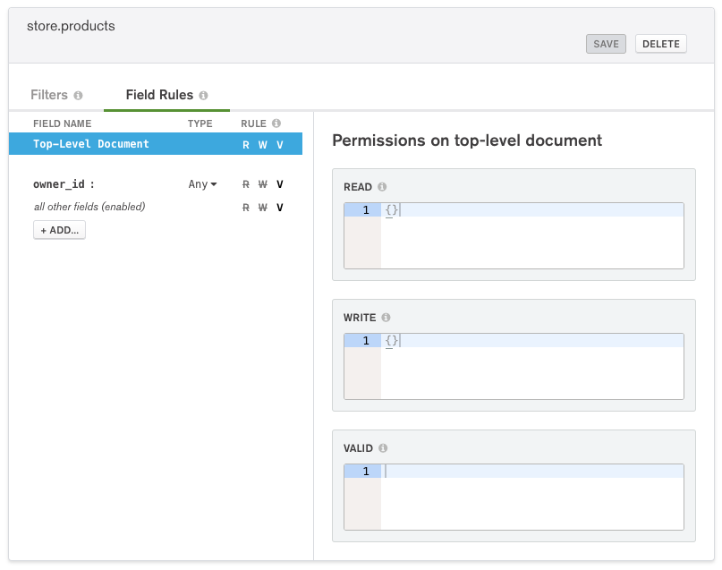

Likewise, select **Filters** and delete the default filter:

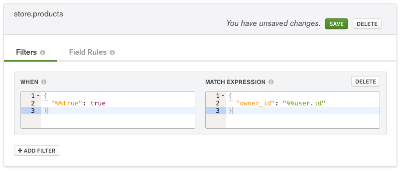

Then save your changes.

## Test the API

Return to your `getProductsByName` function and run the function again. And now you'll see some results:

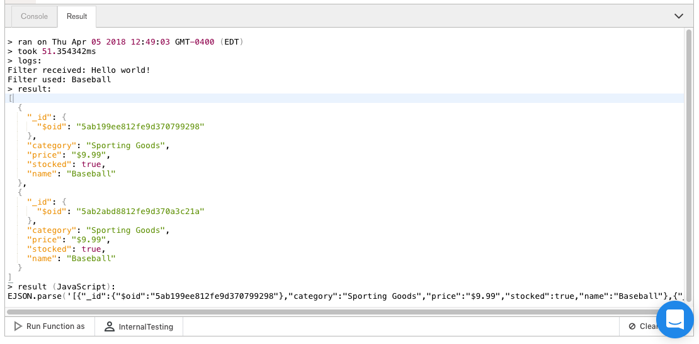

## Use the API

Now that we have an API, let's call it from a client. For this exercise, I'm going to use the [Thinking in React](https://reactjs.org/docs/thinking-in-react.html) sample client. In that client, the product data is hard-coded, so we are going to update the client to pull the data dynamically using our new API.

Let's start by getting the static client up and running. For this I will use [Create React App](https://github.com/facebook/create-react-app). 

```shell
    brians-mbp-2:stitch brianleonard$ npx create-react-app store

    Creating a new React app in /Users/brianleonard/GitProjects/stitch/store.

    Installing packages. This might take a couple of minutes.
    Installing react, react-dom, and react-scripts...


    > fsevents@1.1.3 install /Users/brianleonard/GitProjects/stitch/store/node_modules/fsevents
    > node install

    [fsevents] Success: "/Users/brianleonard/GitProjects/stitch/store/node_modules/fsevents/lib/binding/Release/node-v57-darwin-x64/fse.node" already installed
    Pass --update-binary to reinstall or --build-from-source to recompile

    > uglifyjs-webpack-plugin@0.4.6 postinstall /Users/brianleonard/GitProjects/stitch/store/node_modules/uglifyjs-webpack-plugin
    > node lib/post_install.js

    + react-dom@16.3.1
    + react@16.3.1
    + react-scripts@1.1.4
    added 1443 packages from 799 contributors in 37.824s

    Success! Created store at /Users/brianleonard/GitProjects/stitch/store
    Inside that directory, you can run several commands:

    npm start
        Starts the development server.

    npm run build
        Bundles the app into static files for production.

    npm test
        Starts the test runner.

    npm run eject
        Removes this tool and copies build dependencies, configuration files
        and scripts into the app directory. If you do this, you can’t go back!

    We suggest that you begin by typing:

    cd store
    npm start

    Happy hacking!
```

Copy of the contents of [src/AppStatic.js](src/AppStatic.js) to `src/App.js`.

Run the static version of the app:

    cd store
    npm start


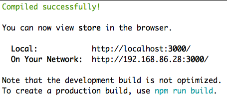

Which should also launch the app in your browser:

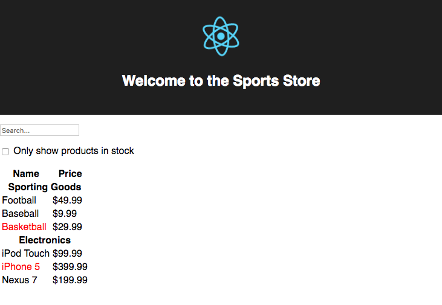

Now let's update the application to call our Stitch API. 

First, we need to install the Stitch library:

```shell
    brians-mbp-2:store brianleonard$ npm install mongodb-stitch --save
    npm WARN ajv-keywords@3.1.0 requires a peer of ajv@^6.0.0 but none is installed. You must install peer dependencies yourself.

    + mongodb-stitch@3.0.7
    added 7 packages from 6 contributors in 10.379s
```

Then in `src/App.js`, import the StitchClientFactory:

```javascript
    import { StitchClientFactory } from "mongodb-stitch";
```

Next we need to set up the connection to Stitch, for which we need the App ID. Back in Stitch, select **Clients** and copy the AppID:

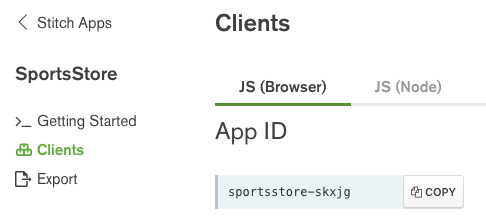

Then, back in App.js, set up the Stitch connection using the copied App ID:

```javascript
    // Set-up Stitch Connection
    const stitchClientPromise = StitchClientFactory.create("sportsstore-skxjg");
```

For now, let's log in anonymously...

```javascript
    // Authenticate
    stitchClientPromise.then(stitchClient => {

        // Authenticate anonymously 
        stitchClient.login().then(() => console.log('logged into Stitch as: ' + stitchClient.authedId()))
            .catch(e => console.log('error: ', e));
    });
```

Save App.js. React automatically reloads the application every time it detects a change. If you open your browser's JavaScript console, you can verify that you logged into Stitch successfully.

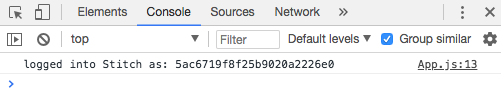

Add products to the state of the `FilterableProductTable`:

```javascript
    class FilterableProductTable extends React.Component {
    constructor(props) {
        super(props);
        this.state = {
        filterText: '',
        inStockOnly: false,
        products: []
        };
```

And change the ProductTable in the `render()` function, to read the products from the `state`, rather than the `props`:

```javascript
 render() {
        return (
        <div>
            <SearchBar
            filterText={this.state.filterText}
            inStockOnly={this.state.inStockOnly}
            onFilterTextChange={this.handleFilterTextChange}
            onInStockChange={this.handleInStockChange}
            />
            <ProductTable
            products={this.state.products}
            filterText={this.state.filterText}
            inStockOnly={this.state.inStockOnly}
            />
        </div>
        );
    }
```

Now whenever the state changes, the table will re-render. As of now, it should be rendering empty:

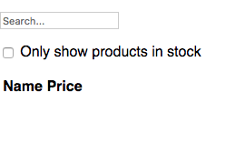

Beneath the constructor of the FilterableProductTable, add the following getData function to call our API:

```javascript
    getData(filterText) {
        console.log("Entered getData(" + filterText +")");
        return stitchClientPromise.then(stitchClient =>
        stitchClient.executeFunction("getProductsByName", filterText)
            ).then(result => {
            console.log('success getting products from Stitch: ', result)
            return result;
        })
        .catch(e => {
            console.log('error', e)
            return []
        });
    }
```

Then update the `handleFilterTextChange` method to call `getData()`, updating the component's state:

```javascript
    handleFilterTextChange(filterText) {
        this.getData(filterText).then(products => this.setState({ products: products, filterText: filterText }))
        .catch(e => {
            console.log('error', e)
        });
    }
```

And now our React Sports Store is dynamic, calling an API to refresh its content:

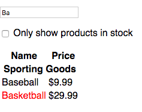

 Does it make sense to call the API on every keystroke, maybe not, but I wanted to demonstrate the performance of Stitch. Obviously, this is a very small data set, but the point here was the to lay the groundwork for how Stitch could be the platform for your microservice APIs.

 ## Advance To Go

If you just want to see the app in action, simply clone this repository and run the app:

    git clone https://github.com/wbleonard/stitch-api-react.git
    npm install
    npm start
 
 ## Troublshooting

The Stitch Console is your friend. As are the Stitch Logs. Here's the log for the request that produced the results above:

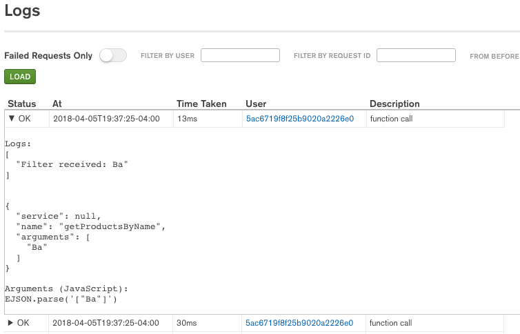

 If using React, be sure to install the React Developer Tools for [Chrome](https://chrome.google.com/webstore/detail/react-developer-tools/fmkadmapgofadopljbjfkapdkoienihi?hl=en) or [Firefox](https://addons.mozilla.org/en-US/firefox/addon/react-devtools/).

 Happy Coding!

 


